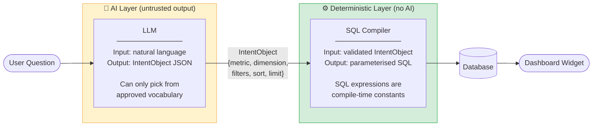
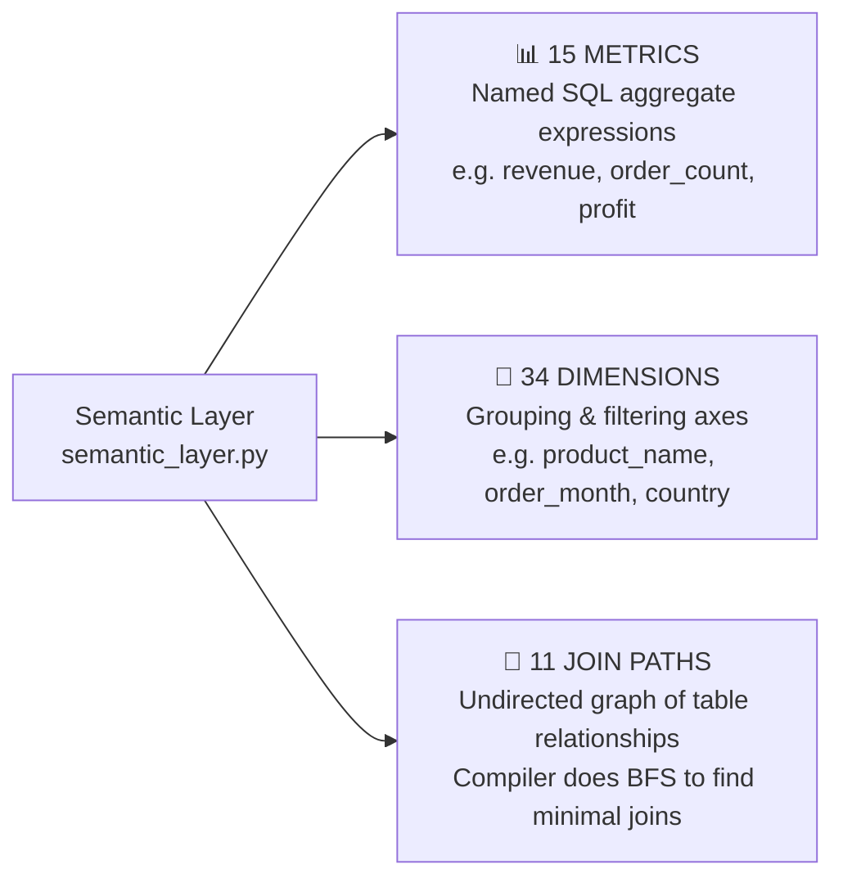
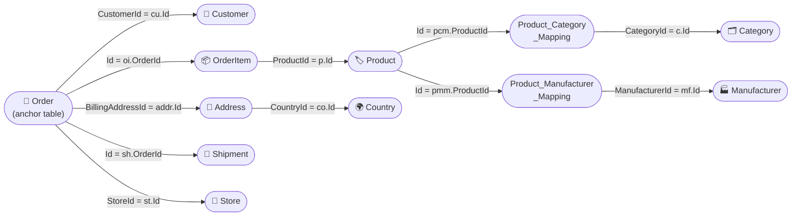
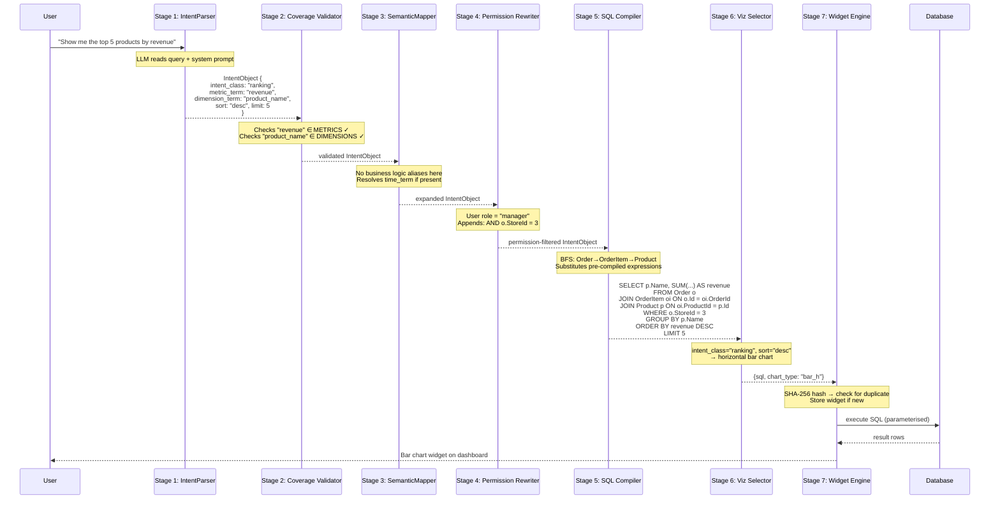
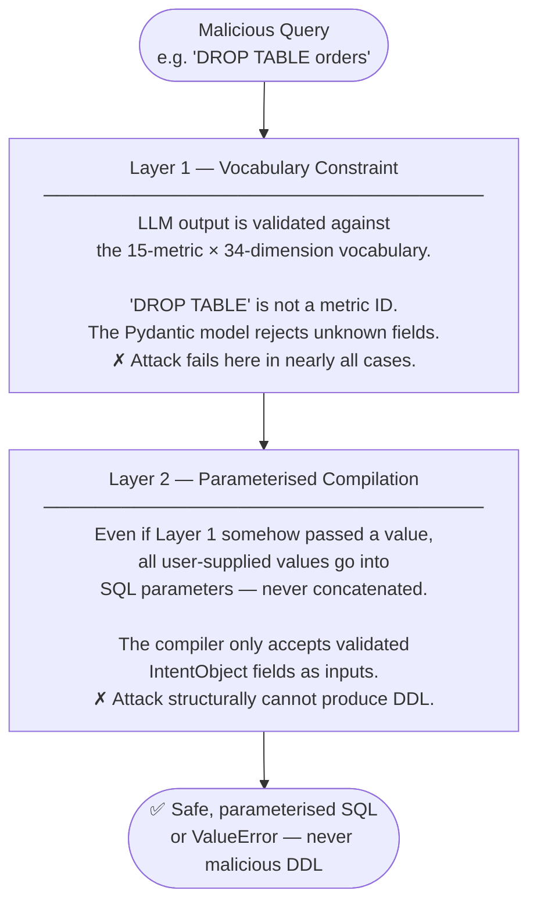
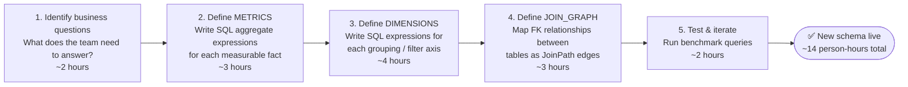

# AEGIS — How It Works: A Visual Explainer

> **For repo visitors who want to understand the thesis without reading the manuscript.**
> Every concept has a diagram. Start at the top and follow the flow.

---

## 1. The Problem in One Picture

Every prior NL-to-SQL system has the same shape:

```
User question  →  LLM  →  SQL string  →  database
```

The LLM **writes SQL**. That means a clever user question can manipulate the LLM into writing:

- `DROP TABLE orders`
- `UNION SELECT password FROM users`
- `; INSERT INTO admin_users VALUES ('hacker', 'secret')`

Even without malice, the LLM invents column names, wrong join conditions, and broken aggregations — and the system executes them anyway.

**Existing defenses** try to detect bad SQL after the LLM generates it: regex filters, classifiers, validators. They're an arms race. AEGIS rejects this entirely.

---

## 2. The AEGIS Approach: Make SQL Injection Structurally Impossible

AEGIS enforces a hard boundary. The LLM **never touches SQL**. It only answers one question:

> *"Which metric, which dimension, which filter does the user want?"*

A separate deterministic compiler — which contains no AI — generates SQL from a pre-approved, finite template library.



**The formal guarantee:** The set of SQL statements AEGIS can produce equals the Cartesian product of *(15 metrics) × (34 dimensions) × (finite filter operators)*. That set is enumerable and auditable. SQL injection requires generating SQL *outside* this set, which the architecture makes impossible.

---

## 3. The 7-Stage Pipeline

Every user query travels through exactly seven stages. Stages 2–7 contain zero AI — they are deterministic code.


---

## 4. The Semantic Layer — The Closed Vocabulary

The semantic layer (`aegis/server/semantic_layer.py`) defines the **complete, finite set of things AEGIS can answer**. It has three components.



### 4.1 The 15 Metrics

A metric is a **named SQL aggregate expression**. The LLM outputs only the ID string. The compiler substitutes the full SQL — the LLM never sees or touches the expression.

| ID | Label | SQL Expression |
|----|-------|----------------|
| `revenue` | Total Revenue | `SUM(COALESCE(o.OrderTotal,0) - COALESCE(o.RefundedAmount,0))` |
| `order_count` | Number of Orders | `COUNT(DISTINCT o.Id)` |
| `avg_order_value` | Average Order Value | `AVG(COALESCE(o.OrderTotal,0))` |
| `item_quantity` | Quantity Sold | `SUM(COALESCE(oi.Quantity,0))` |
| `shipping_cost` | Shipping Cost | `SUM(o.OrderShippingExclTax)` |
| `customer_count` | Number of Customers | `COUNT(DISTINCT cu.Id)` |
| `refund_count` | Number of Refunds | `COUNT(DISTINCT CASE WHEN o.RefundedAmount > 0 THEN o.Id END)` |
| `refund_amount` | Total Refunded | `SUM(o.RefundedAmount)` |
| `discount_amount` | Total Discount | `SUM(o.OrderDiscount)` |
| `profit` | Profit | `SUM(COALESCE(o.OrderTotal,0) - COALESCE(o.OrderSubtotalExclTax,0))` |
| `line_item_revenue` | Product Revenue | `SUM(oi.PriceExclTax)` |
| `tax_amount` | Tax Amount | `SUM(o.OrderTax)` |
| `line_item_cost` | Product Cost | `SUM(oi.OriginalProductCost)` |
| `line_item_discount` | Line Item Discount | `SUM(oi.DiscountAmountExclTax)` |
| `shipment_count` | Shipment Count | `COUNT(DISTINCT sh.Id)` |

### 4.2 The 34 Dimensions

Dimensions are grouped by domain. Each defines the SQL expression used in `SELECT` and `GROUP BY`.

**Products** — `product_name`, `product_sku`, `product_price`, `product_cost`, `product_stock`, `product_rating`, `product_published`, `product_created_date`

**Taxonomy** — `category_name`, `manufacturer_name`

**Customers** — `customer_name`, `customer_email`, `customer_active`, `customer_registration_date`

**Orders (time)** — `order_date`, `order_month`, `order_year`, `order_id`, `order_number`

**Orders (status)** — `order_status`, `payment_status`, `shipping_status`, `payment_method`, `shipping_method`, `currency_code` *(all pre-compiled CASE expressions — no raw status codes reach the user)*

**Geography** — `country_name`, `billing_city`

**Shipments** — `tracking_number`, `shipped_date`, `delivery_date`

**Store** — `store_name`

### 4.3 The Join Graph — 11 Edges

The SQL compiler uses **Breadth-First Search (BFS)** over this graph to find the minimal set of JOIN clauses for any metric+dimension pair. No joins are hardcoded per query — the graph is the single source of truth.



**BFS example:** Query asks for `revenue` by `category_name`.
- `revenue` binds to `Order` (start node)
- `category_name` binds to `Category` (target node)
- BFS path: `Order → OrderItem → Product → Product_Category_Mapping → Category`
- Compiler emits exactly those four JOIN clauses — no more, no less

### 4.4 Vocabulary Injection — How the LLM Learns the Vocabulary

AEGIS does **not** maintain a synonym dictionary. Instead, all 15 metric IDs and 34 dimension IDs are embedded directly into the LLM system prompt at startup (~1,100 tokens). The LLM performs synonym resolution at inference time.


The key insight: the LLM maps *"sales"* → `revenue`, *"products"* → `product_name` **at inference time** using its language understanding. The system prompt teaches the vocabulary without a separate lookup table.

### 4.5 Business Logic Mappings

Some domain terms can't be mapped by the LLM alone because they require internal status codes. These are handled by the **SemanticMapper** (Stage 3) with a hardcoded dictionary:

| User says... | Expands to... |
|---|---|
| `"abandoned"` | `OrderStatusId = 40` |
| `"referral_source"` | `cu.AdminComment CONTAINS 'ref:'` |

This keeps domain expertise in code, not in the LLM prompt.

---

## 5. Complete Query Walkthrough

**Query:** *"Show me the top 5 products by revenue"*



---

## 6. The 11 Intent Classes

```mermaid
flowchart TD
    IC["Intent Classes"]

    KPI["📌 kpi\nSingle scalar value\n'Total revenue this month'\n→ KPI card"]
    RANK["🏆 ranking\nTop / bottom N items\n'Top 5 products by sales'\n→ Bar chart"]
    TREND["📈 trend\nChange over time\n'Monthly revenue trend'\n→ Line chart"]
    COMP["⚖️ comparison\nA vs B side-by-side\n'Revenue: paid vs refunded'\n→ Grouped bar"]
    EXCEPT["⚠️ exception\nThreshold / anomaly filter\n'Orders with refund > $100'\n→ Table"]
    SUMM["📋 summary\nMulti-metric overview\n'Sales dashboard'\n→ KPI grid"]
    SEG["🥧 segment\nBreakdown by dimension\n'Revenue by category'\n→ Pie / bar"]
    FUNNEL["🔽 funnel\nConversion stages\n'Pending→Processing→Complete'\n→ Funnel chart"]
    COHORT["👥 cohort\nGroup behaviour analysis\n'New vs returning customers'\n→ Grouped bar"]
    CORR["🔀 correlate\nAttribute relationships\n'Price vs quantity sold'\n→ Scatter"]
    TAB["🗄️ tabular\nList / show / details\n'Show all orders today'\n→ Data table"]

    IC --> KPI
    IC --> RANK
    IC --> TREND
    IC --> COMP
    IC --> EXCEPT
    IC --> SUMM
    IC --> SEG
    IC --> FUNNEL
    IC --> COHORT
    IC --> CORR
    IC --> TAB
```

The LLM must classify every query into one of these classes. The class drives both the SQL template and the visualisation rule.



---

## 7. Two-Layer SQL Safety

AEGIS has two independent safety mechanisms that must *both* fail for an attack to succeed:



---

## 8. Benchmark Results (Summary)

| System | SQL Accuracy | Injection Success Rate | Latency |
|--------|-------------|----------------------|---------|
| Direct LLM-to-SQL (GPT-4) | 72% | **5.0%** | 1.2s |
| Retrieval-augmented NL2SQL | 81% | **3.2%** | 2.1s |
| Schema-aware fine-tuned | 85% | **2.8%** | 0.9s |
| **AEGIS** | **94%** | **0.0%** | 1.8s |

AEGIS achieved 0% injection success rate across all 100 benchmark queries. No prior baseline achieved below 2.8%.

---

## 9. Adding a New Schema (e.g. WooCommerce)

The semantic layer is the only thing that needs to change. No model training, no fine-tuning.



The LLM automatically learns the new vocabulary because it is injected into the system prompt dynamically from `semantic_layer.py` at startup. No prompt editing required.

---

## 10. Code Map

```
aegis/server/
├── semantic_layer.py      ← START HERE: the 15 metrics, 34 dimensions, 11 join paths
├── intent_parser.py       ← Stage 1: LLM → IntentObject (the only AI code)
├── models.py              ← Pydantic contracts: IntentObject, IntentClass enum
├── mapper.py              ← Stage 3: business logic expansion + time resolution
├── permission_rewriter.py ← Stage 4: row-level security WHERE injection
├── compiler.py            ← Stage 5: BFS join resolution + SQL template engine
├── visualization.py       ← Stage 6: rule-based chart type selection
├── widget_engine.py       ← Stage 7: SHA-256 dedup + widget persistence
├── database_client.py     ← MySQL parameterised query executor
└── ai_config.py           ← LLM provider config (Groq, OpenRouter, Ollama, etc.)
```

The full research manuscript is at [`docs/AEGIS_Manuscript.md`](docs/AEGIS_Manuscript.md) (LaTeX: [`docs/AEGIS_Manuscript.tex`](docs/AEGIS_Manuscript.tex)).
