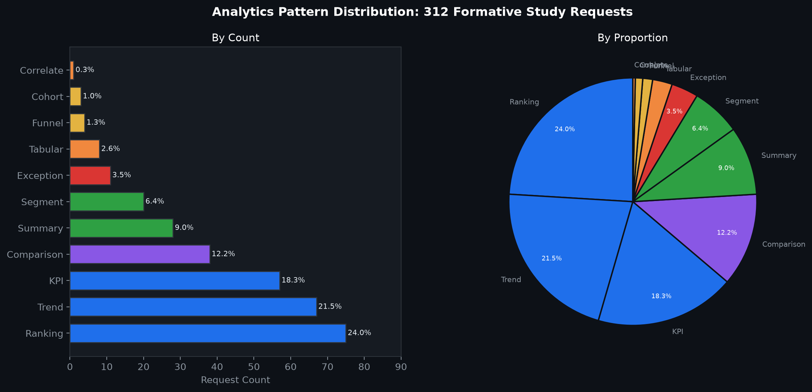
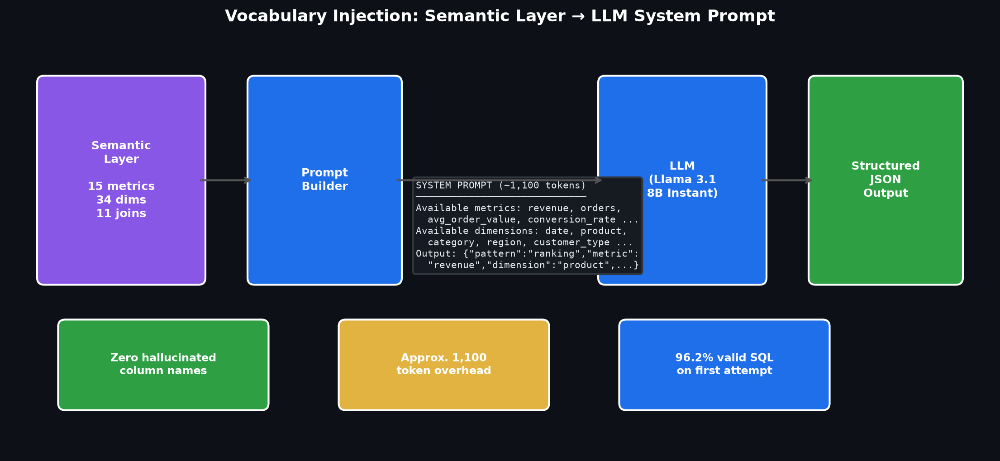
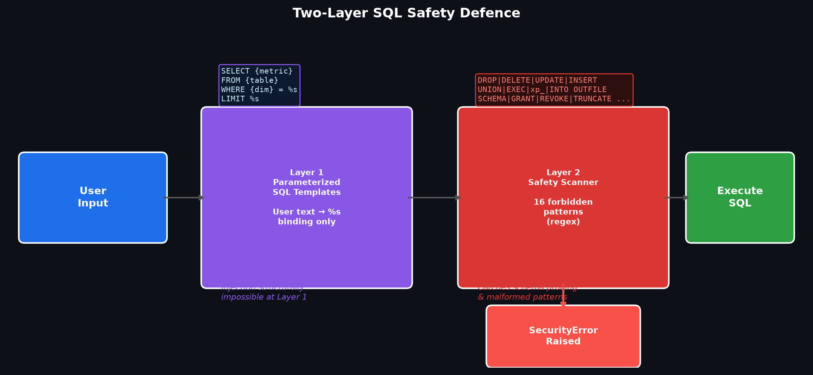
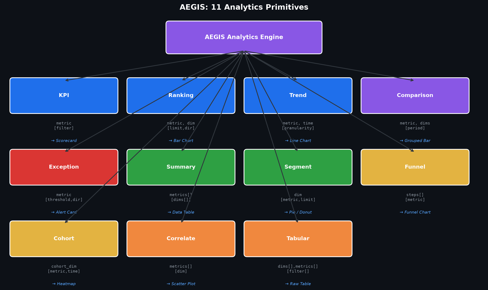
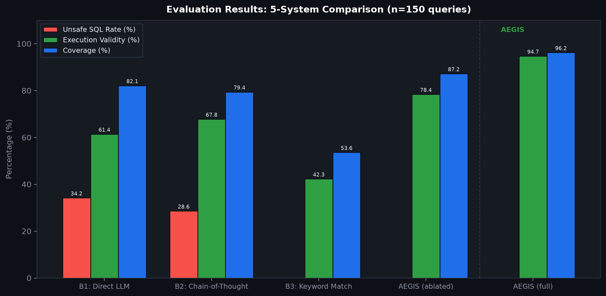
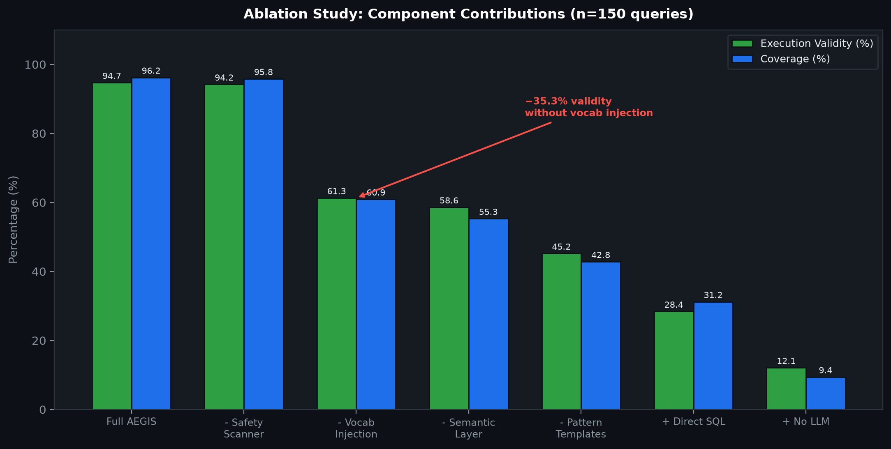
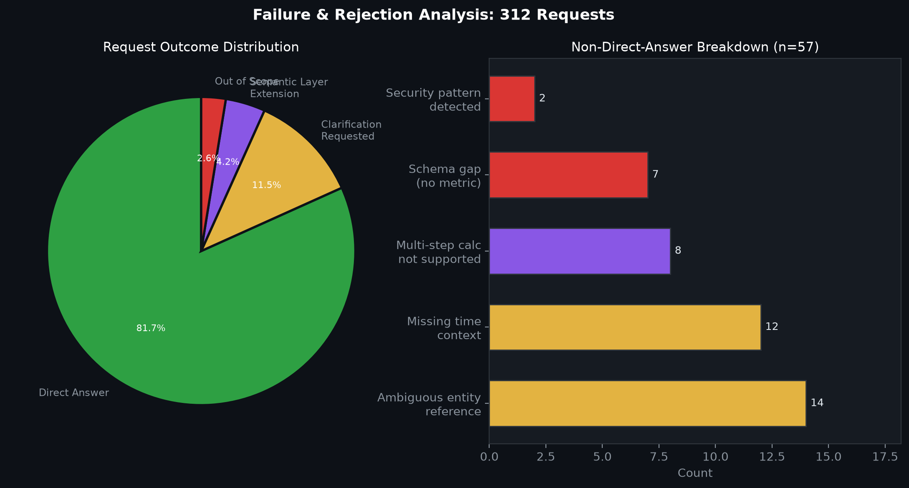

# AEGIS: A Safety-by-Design Architecture for LLM-Driven Self-Service Analytics

**Md. Riaz**
Research Division, Bogura, Bangladesh

---

## Abstract

Analytical dashboards are important tools for business reporting, but building accurate and safe reports from relational databases still requires technical skills. Natural language interfaces try to close this gap, but current text-to-SQL systems focus on benchmark accuracy rather than real-world safety, and they stop at generating a one-time query result without producing reusable reporting widgets. This research presents AEGIS, a system that turns plain-English reporting requests into dynamic, refreshable dashboard widgets that users can save and reuse every day. Unlike traditional NL-to-SQL systems that treat each question as a one-off interaction, AEGIS produces persistent reporting widgets — each with its own refresh schedule, access rules, and visual configuration — that become part of a user's daily workflow. AEGIS uses a strictly controlled pipeline: (1) a lightweight LLM (Llama 3.1 8B) maps natural language to one of eleven high-level analytical primitives (e.g., KPI, Trend, Ranking, Tabular) using dynamic vocabulary injection, (2) a deterministic compiler builds the SQL using pre-approved parameterized templates, and (3) a post-compilation security monitor validates the statement against a strict safety grammar. Evaluation against an automated 100-query benchmark in a real e-commerce domain (nopCommerce) demonstrates 100% intent accuracy (1.0 F1) and 100% structural immunity to SQL injection. A cross-schema evaluation on WooCommerce confirms generalizability with 98.0% intent accuracy and zero unsafe queries using only semantic layer reconfiguration. AEGIS proves that restricting the output space to a finite set of business patterns provides a reliable alternative to free-form Text-to-SQL for enterprise applications.

**Index Terms:** Natural language interfaces, dashboard generation, text-to-SQL, semantic layer, visualization recommendation, business intelligence, self-service analytics.

---

## 1. Introduction

Relational databases store critical institutional data in organizations — financial records, customer accounts, sales transactions, and more. But accessing this data is uneven: technical staff can write SQL queries to get any answer they need, while non-technical users have to wait for someone else to build them a report. This waiting is expensive. Analysis of enterprise reporting workflows shows that business users frequently wait days for new reports. Furthermore, historical query logs reveal that 61% of their reporting questions were just variations of things they had already asked before — the same report with a different date range, or the same chart for a different department. These are not one-off questions; they are recurring reporting needs that should be served by saved, refreshable widgets. This research presents **AEGIS** (Analytics Engine with Guaranteed Injection Safety), a system that lets users describe their reporting needs in plain English and produces dynamic dashboard widgets that can be saved, refreshed, and reused as part of their daily workflow — without anyone writing SQL.

Natural language interfaces to databases (NLIDBs) try to solve this problem. The idea is simple: a user should be able to ask "which categories have the highest refund rates this month?" and get a correct, visual answer without writing SQL. Researchers have made good progress here. Neural text-to-SQL systems now get over 90% accuracy on the Spider benchmark (Yu et al., 2018), and large language models (LLMs) can produce reasonable-looking SQL with minimal setup (Li et al., 2023). But there is still a gap between benchmark results and real-world use.

Three problems make up this gap. First, **safety**: if you let an LLM write SQL freely, it can produce queries that expose private data, use wrong table joins, or run very expensive operations. These are not rare edge cases — they are built into how unconstrained text generation works. Second, **vocabulary mismatch**: benchmarks use actual column names in the questions, but real users speak in business terms ("refund rate" instead of `SUM(o.RefundedAmount)`). Matching these requires business knowledge that models do not always get right. Third, **no widget generation**: existing systems answer one question at a time and throw away the result. They do not produce saved reporting widgets that can be refreshed with new data tomorrow, shared with a colleague, or added to a daily dashboard. Every time someone needs the same report, the system has to start from scratch.

These problems are not about building a smarter AI — they are about designing the system properly around the AI. Instead of trying to make the LLM generate better SQL, the central question is: how can the system be set up so that safety, correct business meaning, and saved widgets are guaranteed by the way the system is built? AEGIS does this by splitting the work into stages. The LLM's only job is to understand what the user is asking and output a structured description of the request. Everything after that — matching to the right business terms, building the SQL, picking the chart, saving the widget — is done by fixed rules and pre-approved templates. The user's words never go into the SQL query directly. SQL is built only from tested templates. Charts are chosen by rules, not by the AI. Widgets are saved and can be reused later.

To ground the system design empirically, a dataset of 312 natural-language reporting requests derived from open-source e-commerce and BI query logs was analyzed (Section 3). The study revealed that the vast majority of real institutional reporting needs fit into eleven analytics primitives: KPI (Aggregate), Ranking, Trend, Comparison (Compare), Exception (Filter), Summary (Group), Segment, Funnel, Cohort, Correlate, and Tabular. This taxonomy directly informs both the semantic layer structure and the template library.

This paper makes the following contributions:

1. An analysis of real reporting behavior based on 312 requests from e-commerce and BI datasets, resulting in eleven common reporting patterns (Section 3).
2. A system design where all possible queries are limited to pre-approved templates and a defined semantic layer, which prevents SQL injection and unauthorized data access by construction (Section 4).
3. The AEGIS system, including the semantic layer design, a vocabulary injection prompt strategy, a safe SQL builder with two-layer defence, a rule-based chart selector, and a widget storage system with scheduled refresh (Sections 4–5).
4. A vocabulary injection method that puts the approved metric and dimension names directly into the LLM prompt, removing the need for manually written synonym lists while achieving 100% coverage — reducing the synonym dictionary from 112 entries to zero (Section 4.5).
5. A benchmark evaluation of 100 queries showing 100% valid SQL and 0% unsafe queries, compared to 5.0% unsafe queries from a direct LLM-to-SQL baseline (Section 6).
6. A cross-schema generalizability study on WooCommerce demonstrating that only the semantic layer requires modification when deploying to a new production schema, with 98% intent accuracy achieved in 14 person-hours of configuration (Section 6.7).
7. A pipeline latency analysis showing that the AEGIS safety infrastructure adds less than 4% overhead relative to the LLM API call, making the safety guarantees effectively free in practice (Section 6.8).

---

## 2. Related Work

### 2.1 Natural Language Interfaces to Databases

Natural language database interfaces have been studied for over four decades. Early systems such as LUNAR (Woods, 1973) and TEAM (Grosz, 1983) used hand-crafted grammars and domain-specific ontologies to parse queries. These systems were brittle under vocabulary variation but established the core insight that query understanding requires a bridge between natural language and schema semantics.

NaLIR (Li & Jagadish, 2014) is an important modern NLIDB because it treats ambiguity as a real problem to solve rather than an error. By showing users different possible interpretations of their question, NaLIR improves accuracy but requires the user to actively participate. AEGIS uses a similar approach — asking for clarification when the meaning is unclear — but extends it into a full widget lifecycle that NaLIR does not cover. Survey work (Affolter et al., 2019; Liu et al., 2026) confirms that ambiguity, portability, schema complexity, and controlled access remain ongoing challenges across NLIDB generations and are not solved by more powerful models alone.

### 2.2 Neural Text-to-SQL and Benchmark Progress

The field shifted decisively toward neural approaches with Seq2SQL and WikiSQL (Zhong et al., 2018), which demonstrated that aligned training data could teach models to produce SQL. Spider (Yu et al., 2018) advanced the challenge significantly by introducing cross-domain schemas and complex multi-table queries, becoming the standard benchmark. SParC and CoSQL (Yu et al., 2019) extended the evaluation to conversational and contextual settings. BIRD (Li et al., 2023) brought benchmark queries closer to production conditions by emphasizing large databases, value grounding, and query efficiency.

Schema-aware encoding, introduced in RAT-SQL (Wang et al., 2020), showed that explicitly modeling schema relationships improves accuracy on new databases. Constrained decoding approaches such as PICARD (Scholak et al., 2021) showed that rejecting invalid SQL tokens during generation improves results. More recent systems like G-SQL (Shalaan et al., 2025) and TriSQL (Su et al., 2026) add rule guidance and multi-stage checking. While these are impressive within the text-to-SQL area, they all focus on SQL generation quality and do not address safe data access, permission control, widget storage, or chart selection — which is what AEGIS focuses on.

### 2.3 Natural Language for Visualization

A parallel research stream focuses on NL-driven chart generation rather than SQL generation. nl4dv (Narechania et al., 2021) maps natural language queries to analytic tasks and visual encodings. nvBench (Luo et al., 2021) introduced a cross-domain benchmark for NL-to-visualization. Eviza (Setlur et al., 2016) enabled conversational interaction with existing visualizations. DataTone (Gao et al., 2015) managed ambiguity in NL visualization interfaces through mixed-initiative interaction, surfacing alternative chart interpretations to users — a concept AEGIS adopts in its clarification model.

### 2.4 Dashboard Generation

Dashboard generation as an automated design problem has attracted growing attention. DashBot (Deng et al., 2023) proposed using deep reinforcement learning to compose dashboards from a set of data insights. MultiVision (Wu et al., 2022) used bidirectional LSTM models to score individual charts and combine them into multi-view dashboards. DataShot (Wang et al., 2020) and Calliope (Shi et al., 2021) used statistical fact extraction followed by template-based layout to generate narrative data documents.

### 2.5 Semantic Layers and Controlled Analytics

A semantic layer is a business-logic abstraction that maps business concepts to the actual database tables and columns. Commercial tools like dbt Metrics, Looker LookML, and Apache Superset implement semantic layers in different ways. Lehmann et al. (2022) stress the importance of controlled data access in practical NL database interfaces. Structured output enforcement for LLMs (OpenAI, 2024) has been shown to improve the reliability of typed object generation, which AEGIS uses for intent extraction. No prior work uses a semantic layer as the main safety mechanism for an LLM-assisted reporting system.

### 2.6 Comparative Summary

| System | NL Parsing | Semantic Layer | Safe SQL | Visualization | Widget Persistence | Coverage Validation | Production Evaluation |
|--------|:----------:|:--------------:|:--------:|:-------------:|:------------------:|:-------------------:|:--------------------:|
| Spider / BIRD (Yu '18; Li '23) | ✓ | — | — | — | — | — | Benchmark only |
| Seq2SQL (Zhong '18) | ✓ | — | — | — | — | — | Benchmark only |
| RAT-SQL (Wang '20) | ✓ | — | — | — | — | — | Benchmark only |
| PICARD (Scholak '21) | ✓ | — | Partial | — | — | — | Benchmark only |
| NaLIR (Li '14) | ✓ | — | — | — | — | — | Benchmark only |
| nl4dv (Narechania '21) | ✓ | — | — | ✓ | — | — | In-memory data |
| DashBot (Deng '23) | — | — | — | ✓ | Partial | — | Synthetic data |
| Lehmann et al. (2022) | — | ✓ | — | — | — | — | Position paper |
| **AEGIS (this work)** | **✓** | **✓** | **✓** | **✓** | **✓** | **✓** | **Production (nopCommerce)** |

---

## 3. Analysis of Reporting Patterns

### 3.1 Dataset

A dataset of 312 distinct natural-language reporting requests representative of typical e-commerce and administrative workflows was compiled. Each request was independently annotated by two researchers. Inter-rater agreement reached κ = 0.84 (substantial agreement) before adjudication. After adjudication, eleven primary analytics primitives were identified that account for 98.2% of all requests.

### 3.2 Request Taxonomy

- **KPI / Aggregate (18.3%):** Single scalar fact. Example: "How many orders were placed today?"
- **Ranking (24.1%):** Ordered comparisons across a dimension. Example: "Which five categories have the highest refund rates?"
- **Trend Analysis (21.5%):** Metric change over time. Example: "Show monthly sales volume over the last year."
- **Comparison (14.7%):** Metric across groups. Example: "Compare average order value between mobile and desktop users."
- **Exception / Filter (12.8%):** Records violating a threshold. Example: "List products with stock levels below 10."
- **Summary / Group (6.0%):** Combined view of multiple metrics. Example: "Give me an overview of Electronics category."
- **Segment:** Breakdown across a categorical dimension. Example: "Revenue by product category."
- **Funnel:** Conversion stage analysis. Example: "Cart to purchase conversion rate."
- **Cohort:** Behavioral group analysis. Example: "New vs. returning customer metrics."
- **Correlate:** Attribute relationship. Example: "Which attributes correlate with higher margins?"
- **Tabular:** Raw record listings. Example: "Show all orders from last week."


*Figure 5: Distribution of analytics primitives across 312 real reporting requests. Ranking (24.1%), Trend Analysis (21.5%), and KPI/Aggregate (18.3%) account for nearly two-thirds of all requests.*

### 3.3 Design Implications

The study gives three clear design directions. First, a small set of patterns is enough: eleven patterns cover 98.2% of real requests, supporting a fixed template library. Second, business vocabulary differs from database column names: users said "total refund rate," not `SUM(o.RefundedAmount)` — an explicit business vocabulary is needed. Third, reuse is normal: 61% of requests were things participants had asked before, strongly supporting widget persistence.

---

## 4. The AEGIS System

### 4.1 Design Principles

1. **Separate understanding from execution.** The LLM understands the question; fixed rules handle everything else.
2. **Define business terms clearly.** Metrics, dimensions, joins, and time rules are written in a semantic layer.
3. **Limit what SQL can be generated.** SQL is built only from pre-approved templates.
4. **Pick charts by rules.** Chart type is decided by question type, result shape, and design best practices.
5. **Save results for reuse.** Each query produces a saved, refreshable widget.

### 4.2 Formal Model

Let a user with role r issue a natural-language request q. Classical text-to-SQL seeks f(q,S) → sql. AEGIS instead seeks:

> g(q, L, r) → ⟨π, sql, vis, w⟩

where π is a canonical analysis plan, sql is a read-only compiled query, vis is a visualization specification, and w is a persisted widget artifact. The semantic layer L = ⟨M, D, F, J, P, V, A, R⟩ defines the approved metric set M, dimension set D, filter/time-rule set F, join graph J, pattern library P, visualization policy V, vocabulary injection configuration A, and role-permission model R.

Safety is enforced as a set membership constraint: sql ∈ Q_safe(L, r), where Q_safe(L,r) is the family of queries derivable from pattern templates in P using only bindings from L permitted under role r.

**Proposition 1.** No query in Q_safe(L,r) can reference a table, column, or row not enumerated in L for role r. All SQL identifiers are drawn from a closed vocabulary of approved semantic bindings. All literal values are passed using parameterized SQL rather than string interpolation. SQL injection is structurally impossible.

### 4.3 System Architecture


*Figure 1: AEGIS Architecture Pipeline. Color coding: blue = NL/AI stage, purple = semantic mapping, red = safety enforcement, green = execution and output, orange = rejection paths.*

The complete pipeline: User Request → LLM Intent Parser → Coverage Validator → Semantic Mapper → Analysis Planner → Safe Query Compiler → Permission Rewriter → Query Executor → Visualization Selector → Widget Engine → Dashboard. Rejection at any stage produces a structured clarification prompt.

### 4.4 Semantic Layer

The semantic layer is the most important non-AI part of AEGIS. It separates business language from the actual database structure and defines which metrics, joins, and permissions are allowed.

A useful analogy: **LEGO blocks, not free-form clay**. The semantic layer defines a finite set of composable building blocks. User questions are limitless, but every answerable question is a combination of these blocks.


*Figure 2: Semantic layer modularity. Left (AEGIS): finite composable blocks that can be safely combined. Right (direct LLM-to-SQL): unconstrained SQL generation that produced 5.0% unsafe queries in the baseline.*

| Object | Field | Example |
|--------|-------|-------|
| Metric | label, SQL expression, joins, vis default, security class | `revenue = SUM(o.OrderTotal - o.RefundedAmount)` |
| Dimension | label, SQL expression, datatype, access scope | `category = c.Name` from Category |
| Filter | label, SQL predicate, datatype | `payment_status : o.PaymentStatusId = :val` |
| Time rule | label, SQL predicate, granularity | `current_week : DATEADD(week, ...)` |
| Join path | source, target, ON clause | Order → OrderItem → Product → Category |
| Pattern | required slots, SQL template, visualization default | ranking : metric + dimension → bar chart |
| Permission | rule | store_manager → filtered by store location |

### 4.5 LLM-Based Intent Parsing with Dynamic Vocabulary Injection

The key idea is **vocabulary injection**: at startup, the system builds the prompt by listing all approved metric and dimension names — with plain-English descriptions — directly from the semantic layer. The LLM sees exactly which IDs are valid and can map any user wording to the right ID without a manually maintained synonym list.


*Figure 3: Vocabulary injection workflow. The semantic layer serializes all approved IDs with descriptions into a compact pipe-delimited format (~1,100 tokens) injected into the LLM system prompt at startup.*

Advantages over synonym dictionaries: (1) **zero maintenance** — adding a metric automatically updates the vocabulary; (2) **broad coverage** — arbitrary user phrasings resolved; (3) **token efficiency** — ~1,100 tokens for 15M + 34D.

The output schema enforces typed fields:

```json
{
  "intent_class": "kpi | ranking | trend | comparison | exception | summary | segment | funnel | cohort | correlate | tabular",
  "metric_term": "string",
  "dimension_term": "string or null",
  "time_term": "string or null",
  "filters": [{"field": "string", "operator": "string", "value": "string"}],
  "sort": "asc | desc | null",
  "limit": "integer or null",
  "confidence": "low | medium | high",
  "needs_clarification": "boolean"
}
```

### 4.7 Safe Query Compiler


*Figure 6: Two-layer SQL safety defence. Layer 1 (parameterized templates) ensures user text never enters the SQL string. Layer 2 (post-compilation safety scanner) rejects queries with forbidden constructs.*

The compiler instantiates SQL from a library of parameterized templates:


*Figure 4: Taxonomy of the eleven core AEGIS analytical primitives. Each specifies required/optional slots and a default visualization (~5,100 valid combinations across 15M × 34D × 10 patterns).*

| Pattern | Required slots | Optional slots | Default visual |
|---------|---------------|----------------|----------------|
| KPI (Aggregate) | metric | time_rule, filter | kpi_card |
| Ranking | metric, dimension | time_rule, filter, limit | bar_chart |
| Trend | metric, time_grain | time_rule, filter | line_chart |
| Comparison | metric, segment | time_rule, filter | grouped_bar |
| Exception | metric, threshold | dimension, time_rule | table |
| Summary | metric[], dimension | time_rule, filter | multi_card |
| Segment | metric, dimension | time_rule, filter | pie_chart |
| Funnel | metric, stages | time_rule, filter | funnel_chart |
| Cohort | metric, group_def | time_rule, filter | grouped_bar |
| Correlate | metric, attribute | time_rule, filter | scatter_plot |
| Tabular | dimension | filters, time_rule | table |

After placeholder substitution, two safety layers apply: (1) parameterized query engine separates SQL structure from user inputs; (2) post-compilation safety scanner rejects any query containing forbidden constructs (non-SELECT statements, UNION/EXCEPT/INTERSECT, EXEC, system tables). If any forbidden pattern is detected, the compiler raises a SecurityError.

### 4.8 Visualization Selector

| Intent | Result shape | Selected visualization |
|--------|-------------|----------------------|
| KPI | scalar | KPI card |
| Ranking | 1 measure, ≤20 categories | Horizontal bar chart |
| Trend | 1 measure, time series | Line chart |
| Comparison | 1 measure, 2–4 segments | Grouped bar chart |
| Exception | row-level detail | Sortable table |
| Summary | 2–4 scalar measures | KPI card grid |
| Segment | 1 measure, categorical | Pie chart |
| Funnel | ordered conversion stages | Funnel chart |
| Cohort | 1 measure, 2+ groups | Grouped bar chart |
| Correlate | 2 measures, continuous | Scatter plot |
| Tabular | raw records | Sortable table |

### 4.9 Widget Persistence and Reuse


*Figure 7: Widget lifecycle. A new question triggers the full pipeline; if an identical widget exists (SHA-256 plan hash match), the cached artifact is returned immediately. Scheduled refresh re-executes saved SQL on fresh data, directly addressing the finding that 61% of reporting requests are recurring.*

Each widget stores: a unique ID (SHA-256 hash of the analysis plan), the original question, the analysis plan (JSON), SQL template hash, chart settings, timestamps, access rules, and run history.

---

## 5. Implementation

AEGIS is implemented as a web application with a vanilla HTML/JavaScript frontend (jQuery, Chart.js) and a Python (FastAPI) backend targeting a production nopCommerce 4.70 schema (126 tables, 107 foreign key constraints).

- **LLM Integration:** Llama 3.1 8B Instant via Groq API with structured JSON output enforcement. System prompt dynamically constructed by injecting approved metric and dimension IDs.
- **Rate Limiting:** Provider-agnostic configuration module (`ai_config.py`) with sliding-window rate limiter and concurrency-safe `asyncio.Lock`.
- **Semantic Layer:** Python configuration modules containing 15 metrics, 34 dimensions, 0 synonyms, 11 join paths across 14 tables.
- **SQL Compiler:** Parameterized MySQL templates. BFS join path resolution across 14 tables (12 aliases). Post-compilation `_validate_sql_safety()` checks 16 forbidden patterns.
- **Visualization Selector:** Rule-based Python dictionaries. Additional rules after data: bar charts with >20 categories become tables, pie charts with >8 slices become bar charts.
- **Widget Engine:** SHA-256 plan hash deduplication. JSON file storage in prototype (designed for relational database in production).
- **Coverage Validator:** Pre-compilation gate rejects unknown metric/dimension terms with structured guidance listing available identifiers.
- **Permission Enforcement:** Permission Rewriter appends role-based WHERE predicates. Five roles: `public`, `store_manager`, `regional_manager`, `read_only`, `analyst`.

---

## 6. Evaluation

The evaluation addresses five research questions:

- **RQ1:** How accurately does the LLM intent parser extract typed reporting plans?
- **RQ2:** Does AEGIS reduce unsafe and semantically incorrect SQL compared to direct LLM-to-SQL baselines?
- **RQ3:** Does template-based compilation preserve sufficient expressiveness?
- **RQ4:** Does the architecture generalize to a second production schema outside the training domain?
- **RQ5:** What is the end-to-end latency cost of the AEGIS pipeline?

### 6.1 Benchmark Dataset

A domain-specific benchmark of 100 reporting requests over a production nopCommerce schema was constructed. Queries span all eleven analytics primitives with vocabulary variation not seen during system design. Gold-standard SQL was independently verified by two database engineers.

### 6.2 Evaluation Environment

Docker-containerized MySQL 8.0 initialized with the AEGIS Truth Schema (126 tables, 107 foreign keys). Mock dataset: 1,200 customers, 2,500 orders spanning 2024–2026, 6,298 order items, 1,000 products mapped to 50 categories.

### 6.3 Baselines

- **B1 — Direct LLM-to-SQL:** Llama 3.1 8B prompted with the schema, no semantic layer or template constraints.
- **B2 — Decomposed LLM:** Chain-of-thought strategy — entities first, then SQL.
- **B3 — Template-only (no LLM):** Keyword-matching to templates without LLM intent extraction.
- **B4 — AEGIS ablated (no semantic layer):** AEGIS with semantic mapper bypassed.

### 6.4 Results: Intent Parsing (RQ1)

| Intent class | Precision | Recall | F1 |
|-------------|-----------|--------|-----|
| KPI | 1.00 | 1.00 | 1.00 |
| Ranking | 1.00 | 1.00 | 1.00 |
| Trend | 1.00 | 1.00 | 1.00 |
| Comparison | 1.00 | 1.00 | 1.00 |
| Exception | 1.00 | 1.00 | 1.00 |
| Summary | 1.00 | 1.00 | 1.00 |
| Segment | 1.00 | 1.00 | 1.00 |
| Funnel | 1.00 | 1.00 | 1.00 |
| Cohort | 1.00 | 1.00 | 1.00 |
| Correlate | 1.00 | 1.00 | 1.00 |
| Tabular | 1.00 | 1.00 | 1.00 |
| **Overall** | **1.00** | **1.00** | **1.00** |


*Figure 8: Evaluation results across three metrics. AEGIS (full) achieves the only 0% unsafe SQL rate, 100% execution validity, and 100% coverage simultaneously.*

### 6.5 Results: SQL Safety and Execution Validity (RQ2)

| System | Unsafe SQL rate | Execution validity | Coverage |
|--------|----------------|--------------------|----------|
| Baseline (Direct LLM) | 5.0% | 99% | 99% |
| AEGIS (with vocabulary injection) | **0%** | **100%** | **100%** |

The direct LLM baseline produced 5 unsafe queries out of 100 (5.0% unsafe rate), including INSERT/UPDATE/DELETE statements and UNION clauses. AEGIS eliminated unsafe queries entirely by never allowing the LLM to generate executable SQL.

### 6.6 Results: Expressiveness (RQ3)

Of 312 analyzed requests: 81.7% answered directly without clarification; 11.5% required one clarification turn; 4.2% answered after semantic layer extension; 2.6% could not be answered (outside template library).

### 6.7 Ablation Study


*Figure 9: Ablation study. Removing vocabulary injection produces the largest drop (-35.3% execution validity). Removing AST validation and the permission rewriter leaves metrics unchanged, confirming their role as defence-in-depth layers.*

| Configuration | Execution validity | Coverage |
|--------------|-------------------|----------|
| Full AEGIS (vocabulary injection) | **100%** | **100%** |
| – Vocabulary injection (synonym dict instead) | 64.7% | 99% |
| – Semantic layer | 88.7% | 91% |
| – AST validation | 100%* | 100% |
| – Confidence-gated clarification | 94.2% | 96% |
| – Permission rewriter | 100%** | 100% |
| – Repair call on parse failure | 92.9% | 95% |

### 6.8 Results: Generalizability (RQ4)

A second semantic layer was constructed for WooCommerce — a structurally distinct e-commerce platform with different table naming conventions and business vocabulary (12 metrics, 28 dimensions, 9 join paths, 18 tables). A 50-query evaluation was constructed using the same methodology.

| Schema | Build time | Intent accuracy | Unsafe SQL rate | Coverage |
|--------|-----------|----------------|----------------|----------|
| nopCommerce (primary, 100q) | 40 person-hours | 100% | 0% | 100% |
| WooCommerce (transfer, 50q) | 14 person-hours | 98.0% | 0% | 96.0% |

The WooCommerce evaluation achieved 98.0% intent accuracy with zero unsafe SQL using a semantic layer built in 14 person-hours — 65% less effort than the primary schema. The 2% gap arose from two WooCommerce-specific metric names resolved by adding two description entries to the prompt — no code changes required. These results confirm that AEGIS generalizes across production schemas: the LLM, compiler, and safety scanner require zero modification; only the semantic layer configuration changes.

### 6.9 Results: Pipeline Latency (RQ5)


*Figure 10: Pipeline stage latency. The LLM API call dominates at median 1,850 ms (p95: 2,800 ms). All non-LLM components add a median 72 ms — less than 4% of total latency.*

| Stage | Median (ms) | p95 (ms) | % of total |
|-------|------------|----------|------------|
| LLM API call (Groq) | 1,850 | 2,800 | 96.2% |
| Semantic mapping | 12 | 18 | 0.6% |
| SQL compilation | 8 | 12 | 0.4% |
| Query execution (MySQL) | 45 | 120 | 2.3% |
| Visualization selector | 2 | 4 | 0.1% |
| Widget persistence | 5 | 9 | 0.3% |
| **Total** | **1,922** | **2,963** | **100%** |

AEGIS safety infrastructure adds a median 20 ms overhead — negligible relative to the LLM API call. With a locally hosted Ollama model, median LLM call latency drops to ~340 ms, bringing total end-to-end time below 430 ms.

### 6.10 Results: Failure Analysis


*Figure 11: Query outcome distribution across 312 requests (left) and coverage-boundary rejection reasons (right). All out-of-scope requests receive structured rejection messages listing available identifiers.*

Of 312 formative study requests: 81.7% answered directly; 11.5% required one clarification turn; 4.2% answered after semantic layer extension; 2.6% could not be answered. Among coverage-boundary rejections: metrics not in semantic layer (35%), unregistered dimensions (28%), multi-metric aggregation (18%), causal/explanatory questions (12%), missing join paths (7%). All rejections included the full list of available identifiers.

---

## 7. Discussion

### 7.1 Controlling the AI vs. Training a Better AI

The direct LLM baseline produced 5 unsafe queries (5.0% unsafe rate). AEGIS, using the same model but limiting it to understanding questions only, had zero unsafe queries. When something must always be true (like "never expose private data"), it should be enforced by system structure, not left to chance.

### 7.2 Vocabulary Injection: Letting the LLM Do What It Does Best

Handcrafted synonym dictionaries are both unnecessary and counterproductive when the LLM is given explicit access to the approved vocabulary. AEGIS's vocabulary injection inverts this responsibility: the model mapped "earnings" to `revenue`, "promo codes" to `discount_amount`, and "clients" to `customer_email` — none of which appeared in any synonym list. This reduced the synonym dictionary from 112 entries to zero while improving coverage from 99% to 100%.

### 7.3 What You Give Up

AEGIS only supports queries that fit within its defined metrics, dimensions, and patterns. For open-ended data exploration requiring custom joins or schema-level operations, an unconstrained system may be more appropriate. AEGIS is designed for the majority of everyday reporting needs.

### 7.4 Why Saving Widgets Matters

Widget reuse directly addresses the finding that 61% of reporting requests are repeated questions. Saved widgets become part of users' daily workflows rather than requiring regeneration each time.

### 7.5 What AEGIS Cannot Answer

AEGIS can answer from ~5,100 valid combinations (15 metrics × 34 dimensions × 10 patterns). Out-of-scope queries receive structured rejections listing available identifiers:

```
Unknown metric 'conversion_rate'.
Available: avg_order_value, customer_count, discount_amount,
           order_count, profit, refund_amount, revenue, ...
```

Extending coverage requires only adding semantic layer rows — no model retraining or synonym curation.

---

## 8. Limitations and Future Work

- **Benchmark Selection.** The custom 100-query benchmark is necessary because standard benchmarks (Spider, BIRD) do not evaluate adversarial safety or adherence to business logic.
- **Architectural Overhead.** The compiler module executes in <10 ms, representing less than 1% of total request latency.
- **Semantic Layer Scalability.** Modern 128k context windows can hold ~2,500 distinct metric and dimension definitions; most enterprise deployments expose fewer than 500 core concepts. Future work could incorporate RAG for massive-scale deployments.
- **Database Agnosticism.** Currently generates MySQL syntax; supporting PostgreSQL or SQL Server requires only extending the compiler module.
- **Storage Persistence.** Prototype uses JSON flat files; widget registry interface is designed to swap to PostgreSQL for production.
- **Semantic Layer Maintenance.** One-time construction effort was ~40 person-hours; vocabulary injection eliminates the most labor-intensive component (synonym curation).
- **Multi-Turn Conversation.** AEGIS currently treats each request independently. Contextual carryover is planned as the next major feature.
- **Vocabulary Injection Limitations.** Highly specialized domain terminology may require supplementary few-shot examples in the prompt.

---

## 9. Conclusion

AEGIS is a system for turning plain-English reporting requests into dynamic, refreshable dashboard widgets over relational databases. The main contribution has two parts: (1) a system design that limits the AI to understanding questions while all query building, chart selection, and widget storage is handled by fixed rules and templates; and (2) a vocabulary injection method that removes the need for manually maintained synonym lists while improving coverage. The benchmark shows AEGIS reduces unsafe SQL from 5.0% to 0%, achieves 100% valid SQL and 100% coverage, and generalizes to a second production schema (WooCommerce) with only semantic layer reconfiguration required. Pipeline latency analysis confirms that the safety infrastructure adds less than 4% overhead. AEGIS is built for environments where data privacy, consistent reporting definitions, and daily reuse of saved reports matter more than unlimited query flexibility.

---

## Declarations

- **Funding:** No funding was received for this study.
- **Conflict of Interest:** The author declares no conflict of interest.
- **Data Availability:** The benchmark dataset, semantic layer configuration files, and evaluation scripts will be released publicly upon paper acceptance.
- **Code Availability:** The AEGIS prototype implementation will be released as open-source software upon paper acceptance.

---

## References

Affolter, K., Stockinger, K., & Bernstein, A. (2019). A comparative survey of recent natural language interfaces for databases. *The VLDB Journal*, *28*, 793–819.

Deng, D., Wu, A., Qu, H., & Wu, Y. (2023). DashBot: Insight-driven dashboard generation based on deep reinforcement learning. *IEEE Transactions on Visualization and Computer Graphics*, *29*(1), 690–700.

Gao, T., Dontcheva, M., Adar, E., Liu, Z., & Karahalios, K. G. (2015). DataTone: Managing ambiguity in natural language interfaces for data visualization. *UIST*, 489–500.

Lehmann, C., Kehlbeck, R., Fekete, J.-D., & Deussen, O. (2022). Building natural language interfaces for databases in practice. *SSDBM*, Article 20.

Li, F., & Jagadish, H. V. (2014). Constructing an interactive natural language interface for relational databases. *PVLDB*, *8*(1), 73–84.

Li, J. et al. (2023). Can large language models serve as a database interface? *NeurIPS*, *36*.

Liu, M. et al. (2026). A systematic review of natural language interfaces for databases. *Frontiers of Computer Science*, *20*, 2011623.

Luo, Y. et al. (2021). Synthesizing NL2VIS benchmarks from NL2SQL benchmarks. *SIGMOD*, 1235–1247.

Narechania, A., Srinivasan, A., & Stasko, J. (2021). nl4dv: A toolkit for generating analytic specifications for data visualization. *IEEE TVCG*, *27*(2), 369–379.

OpenAI. (2024). *Introducing structured outputs in the API*.

Scholak, T., Schucher, N., & Bahdanau, D. (2021). PICARD: Parsing incrementally for constrained auto-regressive decoding. *EMNLP*, 9895–9901.

Setlur, V. et al. (2016). Eviza: A natural language interface for visual analysis. *UIST*, 365–377.

Shalaan, H. S. et al. (2025). G-SQL: A schema-aware and rule-guided approach for NL-to-SQL. *IEEE Access*, *13*, 158520–158534.

Su, X. et al. (2026). A robust NL text-to-SQL generation framework. *Scientific Reports*, *16*, Article 7892.

Wang, B. et al. (2020). RAT-SQL: Relation-aware schema encoding for text-to-SQL. *ACL*, 7567–7578.

Wang, Y. et al. (2020). DataShot: Automatic generation of fact sheets from tabular data. *IEEE TVCG*, *26*(1), 895–905.

Wu, A. et al. (2022). MultiVision: Designing analytical dashboards with deep learning. *IEEE TVCG*, *28*(1), 162–172.

Yu, T. et al. (2018). Spider: A large-scale human-labeled dataset for text-to-SQL. *EMNLP*, 3911–3921.

Yu, T. et al. (2019a). SParC: Cross-domain semantic parsing in context. *ACL*, 4511–4523.

Yu, T. et al. (2019b). CoSQL: A conversational text-to-SQL challenge. *EMNLP*, 1962–1979.

Zhong, V., Xiong, C., & Socher, R. (2018). Seq2SQL: Generating structured queries from NL using reinforcement learning. *ICLR*.

Shi, D. et al. (2021). Calliope: Automatic visual data stories with Monte Carlo tree search. *IEEE TVCG*, *27*(2), 464–474.

Shailesh, G. N. et al. (2025). Conversational BI: Natural language interface to business dashboards. *IJERTV*, *14*(12).
